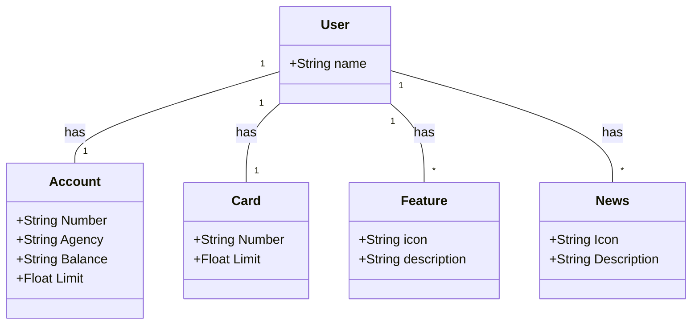

# Santander Dev Week 
Java RESTful API criada para a Santander Dev Week.

## Diagrama de Classes

```mermaid
classDiagram
  class User {
    +String name
  }

  class Account {
    +String Number
    +String Agency
    +String Balance
    +Float Limit
  }

  class Feature {
    +String icon
    +String description
  }

  class Card {
    +String Number
    +Float Limit
  }

  class News {
    +String Icon
    +String Description
  }

  User "1" -- "1" Account : has
  User "1" -- "1" Card : has
  User "1" -- "*" Feature : has
  User "1" -- "*" News : has
```
